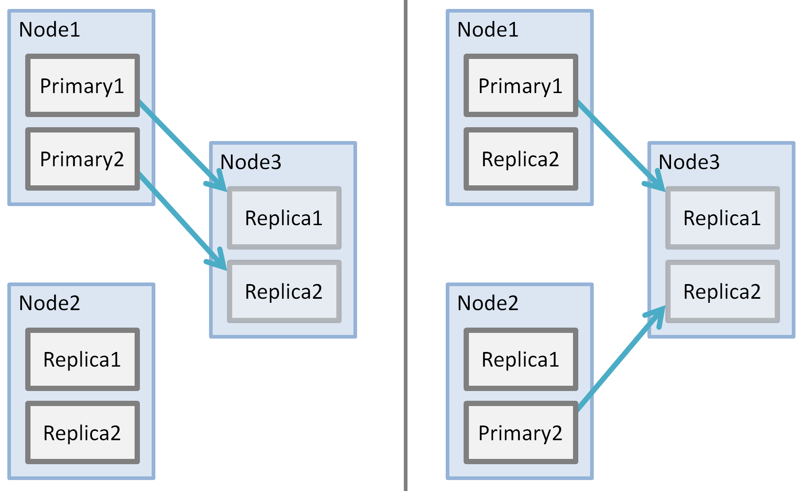

# Balanced Primaries

The `esShardBalancer` will balance the primary shards for two reasons:

## Balanced network activity

During ingestion, the ingested data is sent to the primary, and then the primary sends replication to the replica. If the primaries are not balanced, then network load is not balanced.

## Distributed recovery

Initialization of a replica uses the primary as a source. If the primaries are not balanced, then the network load during recovery will not be balanced.

